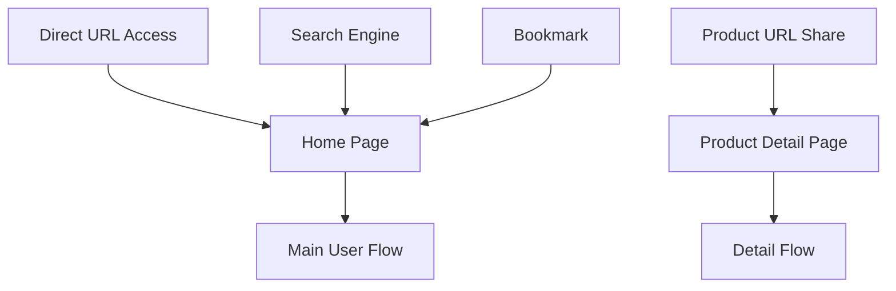
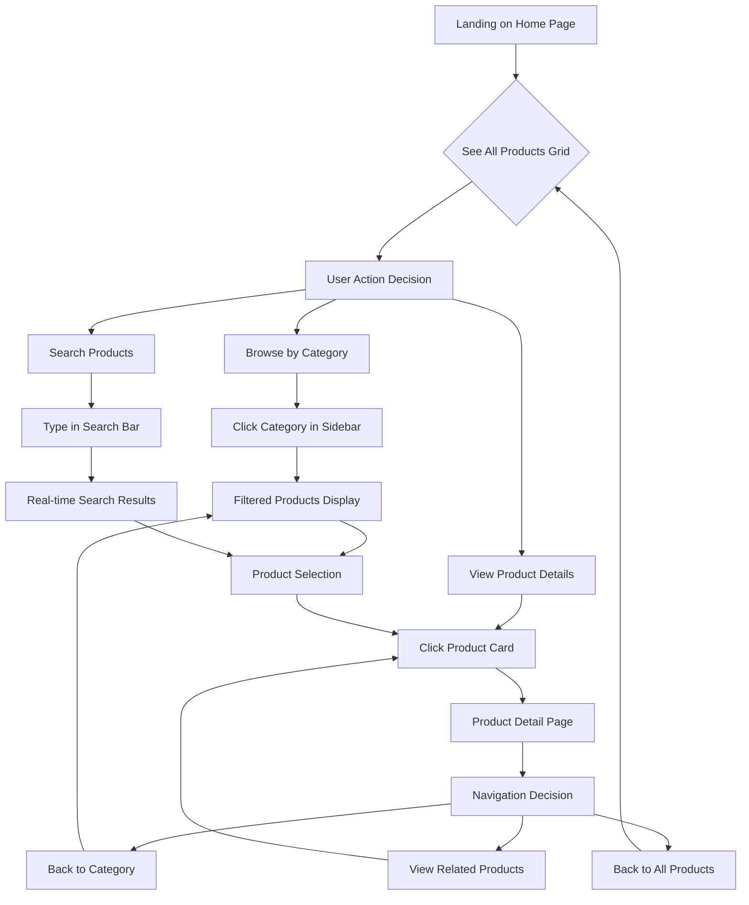
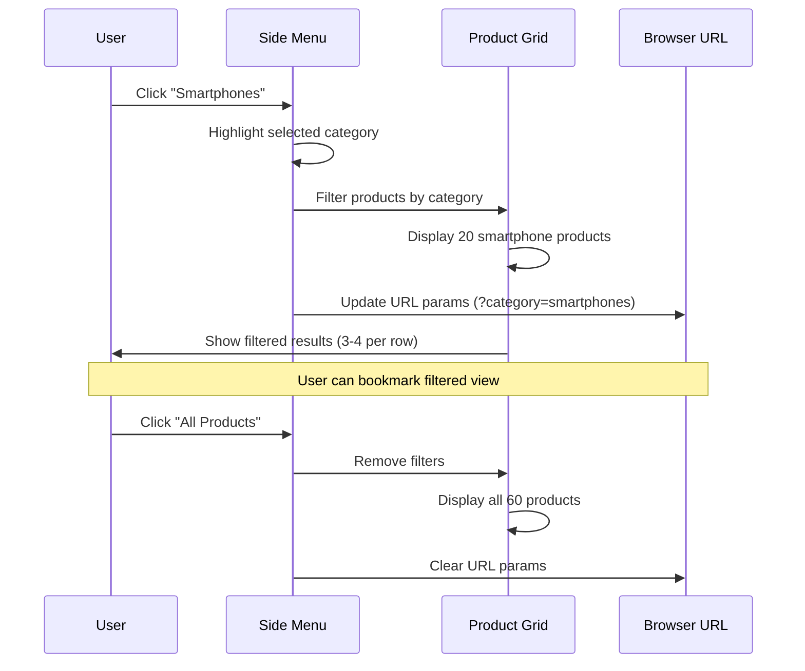
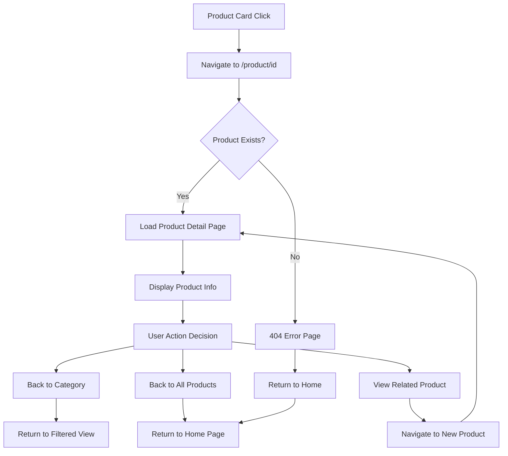
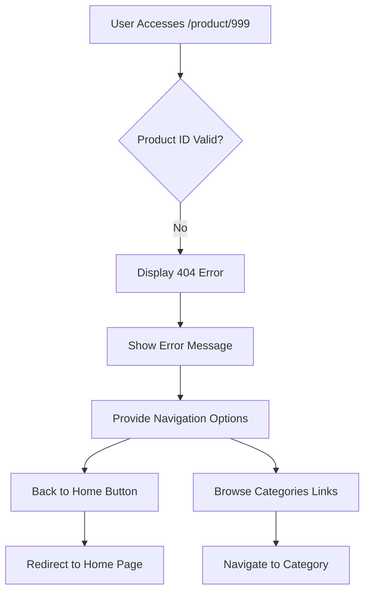
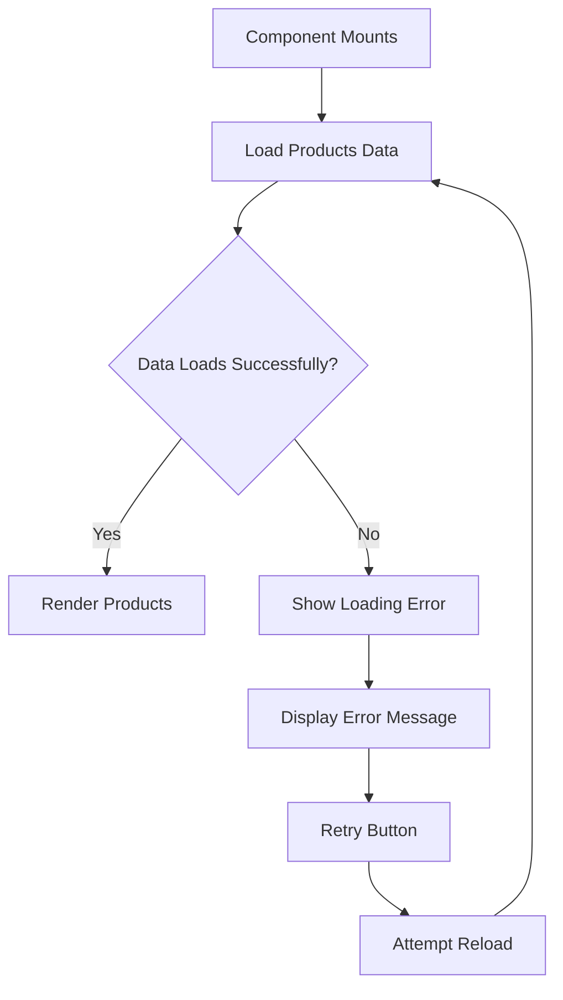
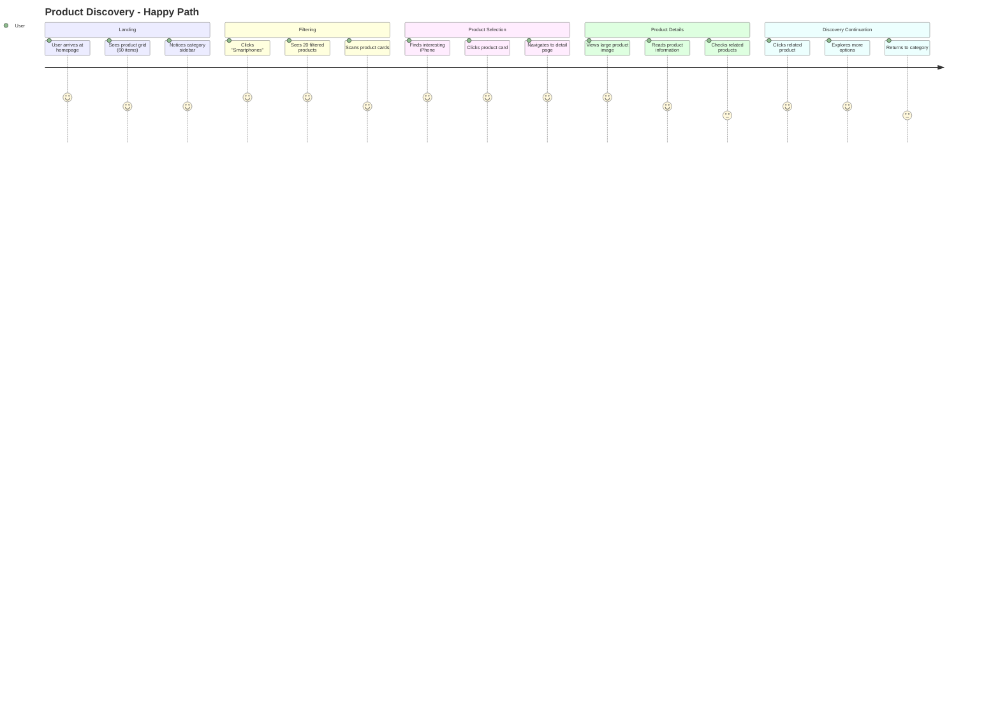
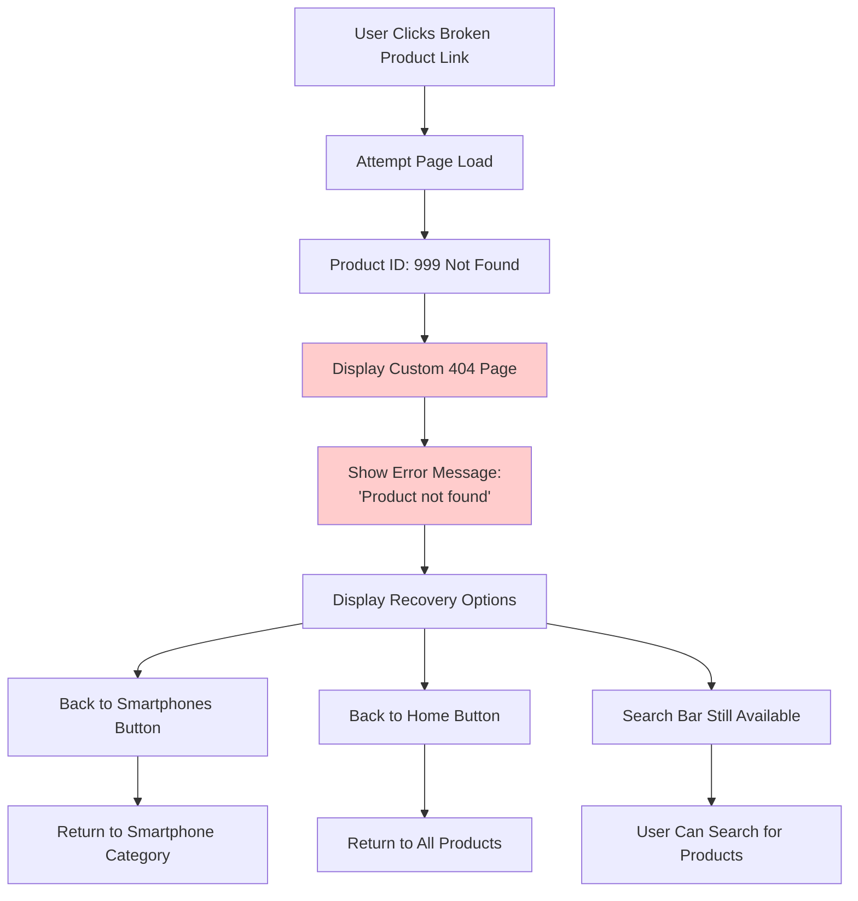

# E-Commerce App User Flow & Experience Design

## Overview
This document defines the user experience flows for the e-commerce MVP application with a 1-hour development timeline. The focus is on core functionality that enables users to browse and view electronic products efficiently.

## MVP Scope & Constraints
- **Timeline**: 60 minutes total development
- **Core Features**: Browse, filter, search, view details
- **User Types**: Casual browsers (no authentication required)
- **Device Focus**: Desktop-first design
- **Data**: Static JSON (60 products across 3 categories)

---

## User Journey Map

### Entry Points


### User Personas & Goals
**Primary Persona**: Tech-savvy consumer browsing for electronics
- **Goal**: Find and compare electronic products quickly
- **Pain Points**: Too many options, unclear product information
- **Success Criteria**: Easy navigation, clear product details, efficient filtering

---

## Core Interaction Flows

### 1. Primary Browse & Discover Flow



**Flow Details:**
- **Entry**: User lands on homepage with all 60 products visible
- **Primary Actions**: Filter by category, search, or view product details
- **Success Metrics**: User finds desired product within 3 clicks
- **Time Estimate**: 30-60 seconds per product discovery

### 2. Category Filtering Flow



### 3. Product Detail & Navigation Flow



### 4. Search Flow

```mermaid
flowchart TD
    A[User Types in Search Bar] --> B[Debounced Input Processing]
    B --> C{Search Term Length > 2?}
    
    C -->|No| D[Show All Products]
    C -->|Yes| E[Filter Products by Name/Brand]
    
    E --> F{Results Found?}
    F -->|Yes| G[Display Filtered Results]
    F -->|No| H[Show "No Results" Message]
    
    G --> I[User Selects Product]
    H --> J[Suggest Clearing Search]
    
    I --> K[Navigate to Product Detail]
    J --> L[Clear Search & Show All]
    
    L --> D
```

---

## Error Handling Flows

### 1. Product Not Found Flow



**Error Scenarios:**
- Invalid product ID in URL
- Product data missing from JSON
- Network issues loading product data

**User Recovery Options:**
- Clear navigation back to home
- Suggested categories to explore
- Search functionality remains available

### 2. No Search Results Flow

```mermaid
flowchart TD
    A[User Searches "xyz123"] --> B[No Products Match]
    B --> C[Display Empty State]
    C --> D[Show Helpful Message]
    
    D --> E[Suggest Alternative Actions]
    E --> F[Clear Search Button]
    E --> G[Browse Categories]
    E --> H[Popular Products]
    
    F --> I[Reset to All Products]
    G --> J[Navigate to Category]
    H --> K[Show Recommended Items]
```

### 3. Data Loading Error Flow



---

## Detailed Example: Complete Product Discovery Flow

### Happy Path Scenario



**Step-by-Step Flow:**

1. **Initial Landing** (0-5 seconds)
   - User arrives at homepage
   - Sees grid of all products (3-4 per row)
   - Notices header with search and sidebar with categories

2. **Category Selection** (5-10 seconds)
   - User identifies "Smartphones" category
   - Clicks sidebar menu item
   - Grid updates to show only smartphones
   - URL updates with category parameter

3. **Product Browsing** (10-30 seconds)
   - User scans 20 smartphone options
   - Compares prices and brands visually
   - Identifies product of interest

4. **Product Detail View** (30-45 seconds)
   - User clicks on iPhone 15 Pro card
   - Navigates to `/product/1`
   - Views large product image and details
   - Sees price, brand, and product name prominently

5. **Related Product Discovery** (45-60 seconds)
   - User scrolls to "You might also like" section
   - Explores 4 related smartphone options
   - Clicks another product or returns to category

### Error Scenario Handling



**Error Recovery Time**: < 5 seconds to return to functional state

---

## Success Metrics

### User Experience Metrics

#### Time-to-Value
- **Target**: Users find relevant product within 30 seconds
- **Measurement**: Time from landing to product detail view
- **Success Threshold**: 80% of users achieve target

#### Navigation Efficiency
- **Target**: Maximum 3 clicks to reach any product
- **Flow Examples**:
  - Home → Category → Product (3 clicks)
  - Home → Search → Product (2 clicks)
  - Home → Product (1 click)

#### Error Recovery
- **Target**: Users recover from errors within 10 seconds
- **Scenarios**: 404 pages, no search results, broken links
- **Success**: Clear navigation options provided

### Technical Performance Metrics

#### Page Load Times
- **Home Page**: < 2 seconds to interactive
- **Product Detail**: < 1.5 seconds to content visible
- **Category Filtering**: < 500ms to update display
- **Search Results**: < 300ms to show results

#### User Flow Completion
- **Browse Flow**: 90% completion rate
- **Search Flow**: 85% completion rate
- **Detail View Flow**: 95% completion rate

### Conversion Indicators (MVP Context)

#### Engagement Metrics
- **Average Session Duration**: > 2 minutes
- **Products Viewed per Session**: > 3 products
- **Category Exploration**: > 2 categories visited
- **Related Product Clicks**: > 1 related product viewed

#### Feature Utilization
- **Search Usage**: 40% of users try search
- **Category Filtering**: 70% of users filter by category
- **Product Detail Views**: 80% of users view at least one detail page
- **Navigation Success**: 95% successful navigation actions

---

## Implementation Priority

### Phase 1: Core Browsing (0-20 minutes)
- Basic product grid display
- Category filtering functionality
- Product card navigation

### Phase 2: Search & Detail (20-40 minutes)
- Search implementation
- Product detail page
- Navigation between pages

### Phase 3: Enhancement & Polish (40-60 minutes)
- Related products section
- Error handling
- UI polish and transitions

### Critical Path Features
1. **Product Grid Display** - Essential for basic browsing
2. **Category Filtering** - Primary navigation method
3. **Product Detail View** - Core product information
4. **Search Functionality** - Alternative discovery method

### Nice-to-Have (Excluded from MVP)
- Product comparison
- User accounts
- Shopping cart functionality
- Product reviews
- Advanced filtering (price, brand)
- Wishlist functionality

---

## User Testing Scenarios

### Scenario 1: First-Time Visitor
**Task**: "Find an Apple laptop under $1500"
**Expected Flow**: Home → Laptops → Browse → Apple MacBook → View Details
**Success Criteria**: Task completion < 45 seconds

### Scenario 2: Specific Product Search
**Task**: "Find Sony headphones"
**Expected Flow**: Home → Search "Sony" → Browse Results → Select Product
**Success Criteria**: Relevant results displayed, product found

### Scenario 3: Casual Browsing
**Task**: "Explore available smartphones"
**Expected Flow**: Home → Smartphones → Browse Multiple Products → View Details
**Success Criteria**: Engages with 3+ products, spends 2+ minutes

### Scenario 4: Error Recovery
**Task**: "Handle broken product link"
**Expected Flow**: Broken Link → 404 Page → Return to Browse
**Success Criteria**: Returns to functional state < 10 seconds
